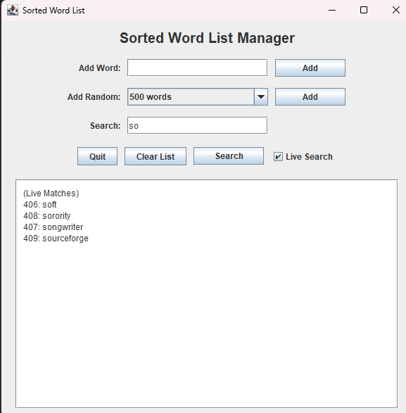

# Sorted List GUI

A Java Swing GUI application for managing a dynamically sorted list of words. This project demonstrates custom list management with binary search logic, prefix-matching search, and user interaction through a simple graphical interface.

## Features

- **SortedList Data Structure**
    - Maintains a list of strings in sorted order using binary insertion.
    - Supports efficient prefix search and closest match suggestions.
    - Locale-aware sorting using Java's `Collator`, with Japanese support.

- **Search and Add UI**
    - Add single or multiple random words from a word list.
    - Search for exact or closest matches using binary search logic.
    - Toggleable live prefix search suggestions.
    - Display all entries in a scrollable text area.

- **Utility Class**
    - `WordSampler` reads words from a file using reservoir sampling for memory efficiency.

## Technologies

- Java 17+
- Swing GUI framework
- Collator-based string comparison (Unicode-aware)
- Reservoir sampling for word list loading

## Running the Project

To run the application:

1. Open the project in an IDE like IntelliJ or VS Code with Java support.
2. Ensure a word list file is present (default: `filtered_words_minlength3.txt` in root or resources folder).
3. Run the `main` method in `SortedListGUI.java`.

## Screenshots

## License

This project is provided for educational purposes. No external libraries are used beyond the Java Standard Library.
